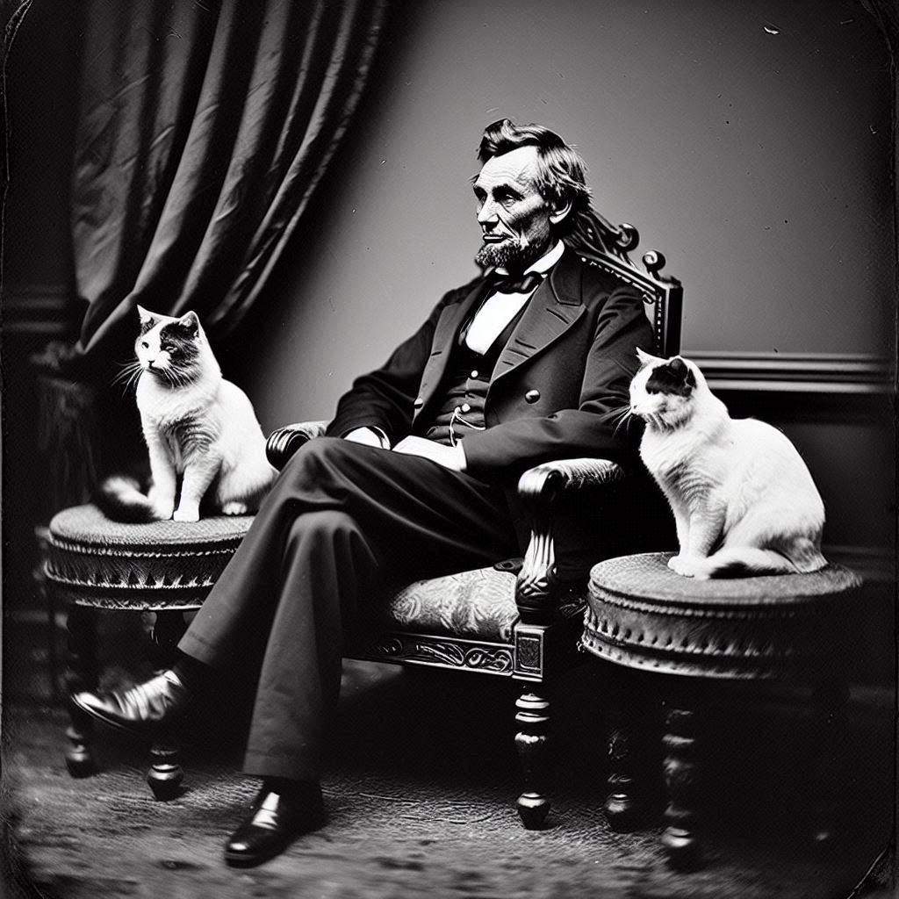

# TcAbbLinkin

## Info
This tool is provided by Loupe.  
https://loupe.team  
info@loupe.team  
1-800-240-7042

## Description
A library for monitoring and controlling ABB robots via TwinCat.

ABB RobotWare exposes an RESTful HTTP server called Robot Web Services ("RWS"). Clients
are able to fetch status, set values, and perform control functions via this interface. This library
allows a user to leverage a small-but-useful subset of the RWS API for common tasks.

### FAQs

#### Q: Why is the library named TcAbbLinkin?

The name of this library is intended to be a pun, sounding like the name of Abraham "Abe" Lincoln, the 16th President of the United States.

## Licensing
This project is licensed under the [MIT License](LICENSE).